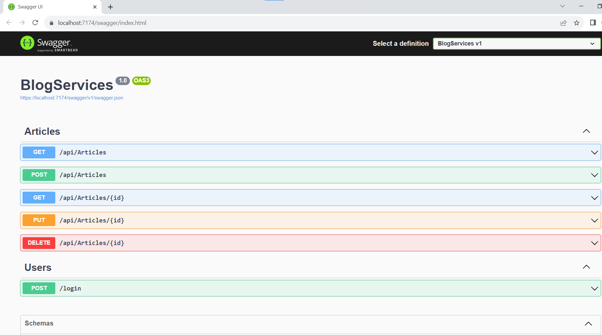

## BlogService

Clone BlogService.Run the this command in the Package Manager Console to install package:
`Install-Package Microsoft.EntityFrameworkCore.SqlServer` 

Run this command to install entity framework core:
`Install-Package Microsoft.EntityFrameworkCore.Sqlite`

Run this commands to create database:
`Install-Package Microsoft.EntityFrameworkCore.Tools`
`Add-Migration InitialCreate`
`Update-Database`

## Run Service

Build service and run it. You will get this screen 